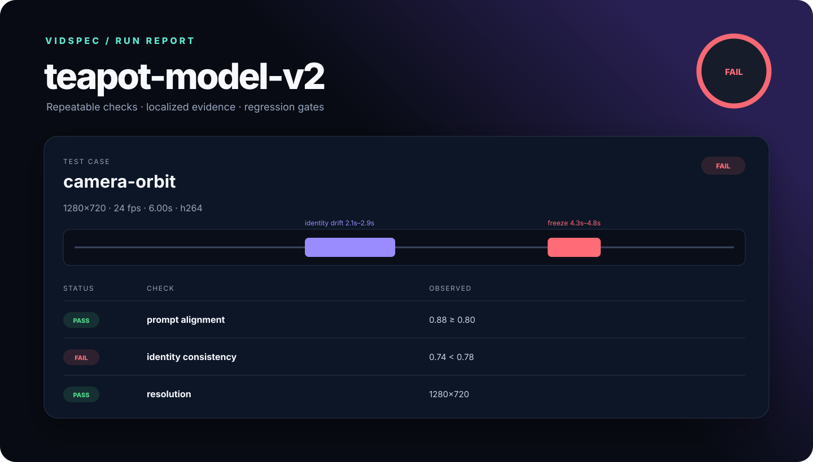
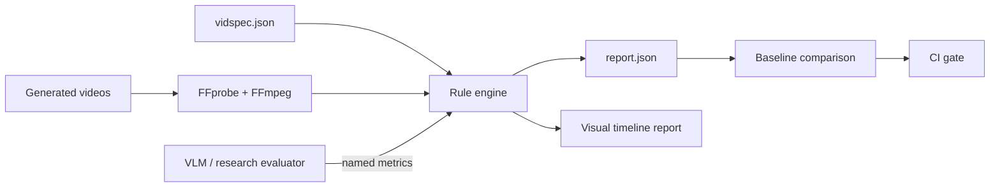

<p align="center">
  
</p>

<h1 align="center">VidSpec</h1>

<p align="center">
  <strong>Unit tests and visual regression reports for generated video.</strong><br>
  Turn prompts and videos into repeatable checks, localized evidence, and CI decisions.
</p>

<p align="center">
  <a href="https://github.com/yingwang/vidspec/actions/workflows/ci.yml"></a>
  <a href="LICENSE"></a>
  
</p>

<p align="center">
  
</p>

Video generation teams often keep a folder of prompts and inspect outputs by eye. A model update
may improve average quality while quietly breaking one camera move, one character, or one long
sequence. A leaderboard score does not show where the failure began.

VidSpec treats generated video like software:

- declare expected behavior in a readable JSON suite;
- run deterministic media checks with FFmpeg;
- ingest scores from any VLM or research evaluator without locking into one provider;
- localize black and frozen intervals on a visual timeline;
- compare candidate runs with a known baseline;
- return non-zero exit codes when a regression should block CI.

> [!IMPORTANT]
> VidSpec is an early, usable foundation, not a claim that video semantics have been solved.
> Version 0.1 validates media properties and temporal defects. Semantic checks enter through an
> explicit metric interface; native identity, action, camera, and physics evaluators are on the
> roadmap.

## Quick start

VidSpec has no required Python dependencies. It uses `ffprobe` and `ffmpeg` for media inspection.

```bash
# macOS
brew install ffmpeg

# install VidSpec from source
git clone https://github.com/yingwang/vidspec.git
cd vidspec
python3 -m pip install -e .

# create a suite, edit its video path, then run it
vidspec init
vidspec run vidspec.json --output reports/latest
open reports/latest/index.html
```

The runner writes both a machine-readable `report.json` and a self-contained `index.html`.

## Define a video contract

```json
{
  "name": "teapot-model-v2",
  "cases": [
    {
      "id": "camera-orbit",
      "video": "videos/camera-orbit.mp4",
      "prompt": "A camera slowly orbits a red ceramic teapot. The teapot remains unchanged.",
      "expect": {
        "duration_seconds": {"min": 4, "max": 8},
        "resolution": {"min_width": 720, "min_height": 480},
        "fps": {"min": 20},
        "codecs": ["h264", "hevc", "av1", "vp9"],
        "black_frames": {"max_total_ratio": 0.01},
        "freezes": {"max_total_ratio": 0.05}
      },
      "metrics": {
        "prompt_alignment": {
          "value": 0.88,
          "min": 0.80,
          "source": "my-vlm-evaluator@8c1d2ef"
        }
      }
    }
  ]
}
```

Paths are resolved relative to the suite and may not escape its directory. External metrics retain
their source label in the report, so a result remains auditable rather than becoming an unexplained
model-generated number.

## Catch a regression

```bash
vidspec run baseline.json -o reports/baseline
vidspec run candidate.json -o reports/candidate

vidspec compare \
  reports/baseline/report.json \
  reports/candidate/report.json \
  -o reports/comparison
```

`compare` returns exit code `1` when a case becomes worse or disappears. Its output contains a JSON
diff and a human-readable comparison page.

## Commands

| Command | Purpose |
| --- | --- |
| `vidspec init [path]` | Create a documented starter suite without overwriting files. |
| `vidspec probe VIDEO` | Print normalized FFprobe metadata as JSON. |
| `vidspec run SUITE` | Execute checks and write JSON plus visual HTML. |
| `vidspec compare OLD NEW` | Detect status regressions between two reports. |

Use `--fail-on never`, `warn`, `fail`, or `error` to control the CI threshold for a run.

## Architecture



The core is deliberately small: configuration, media adapters, a rule engine, serializable domain
models, and reporters. Media subprocesses have narrow seams so tests and future remote runners can
replace them without rewriting the engine.

## What VidSpec is not

- It is not another static leaderboard.
- It does not hide judge prompts, metric provenance, or thresholds.
- It does not upload videos anywhere by default.
- It does not pretend that one aggregate score explains model behavior.

## Research roadmap

The next layer is a library of native, evidence-producing semantic probes:

1. entity count and identity consistency, with tracked regions on the timeline;
2. action completion and prompt-event ordering;
3. camera motion classification and shot-boundary stability;
4. geometry and object permanence under occlusion;
5. long-horizon state memory and causal consistency;
6. pairwise human review for calibrating automated judges;
7. a GitHub Action and adapters for popular open video models.

The design principles and proposed evidence schema live in [docs/research-design.md](docs/research-design.md).

## Development

```bash
python3 -m pip install -e '.[dev]'
ruff check .
pytest -q
```

Contributions should add inspectable evidence, not only another opaque score. See
[CONTRIBUTING.md](CONTRIBUTING.md).

## License

[MIT](LICENSE)

