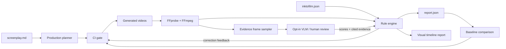

<p align="center">
  
</p>

<h1 align="center">InkToFilm</h1>

<p align="center">
  <strong>One prompt or screenplay. One finished film.</strong><br>
  InkToFilm turns your story into shots, generates them, checks what the audience will see,<br>
  fixes weak takes, and edits the approved footage into a film.
</p>

<p align="center">
  <a href="https://github.com/yingwang/inktofilm/actions/workflows/ci.yml"></a>
  <a href="LICENSE"></a>
  
</p>

<p align="center">
  
</p>

Bring a one-line premise, a scene brief, or your own complete screenplay. InkToFilm acts as the
production system around the models you choose: it develops the story into a shootable plan,
maintains the creative constraints, generates every shot, rejects broken takes with visible
evidence, retries only what failed, and assembles the result into a final video.

```text
"Make a 30-second theatrical trailer in which the Monkey King challenges Heaven."
                                      ↓
 story plan → character bible → shot list → generated takes → review → retry → final.mp4
```

The current release makes complete 30–60 second films and proof-of-concept episodes. The same
scene-based, resumable pipeline is intended to scale to feature films and episodic television:
produce one scene at a time, carry a shared character and world bible across them, then assemble
approved scenes into an episode or feature.

## What InkToFilm does

InkToFilm treats filmmaking as a creative loop with testable delivery:

- turn one idea, prompt, or screenplay into a structured production plan;
- preserve character, world, visual-style, dialogue, and continuity requirements;
- generate each shot through MiniMax H3 or an explicitly selected custom command;
- judge failed shots, feed concrete corrections back, and regenerate only what broke;
- edit approved shots into a watchable final film;
- declare expected behavior in a readable JSON suite;
- run deterministic media checks with FFmpeg;
- turn prompts into scored semantic assertions without locking into one VLM;
- attach sampled frame evidence, timestamps, rationale, and evaluator provenance;
- localize black and frozen intervals on a visual timeline;
- compare candidate runs with a known baseline;
- return non-zero exit codes when a regression should block CI.

> [!IMPORTANT]
> InkToFilm does not claim video semantics have been solved. Media checks are deterministic. Learned
> judgments are only as reliable as the selected evaluator; every score keeps its rationale,
> provenance, and cited frames. Production also preserves every shot attempt in a manifest.

## Make a film from one prompt or your own screenplay

<p align="center">
  
</p>

The default production stack uses an already authenticated
[Codex CLI](https://learn.chatgpt.com/docs/non-interactive-mode) for structured planning and visual
judgment, [MiniMax H3 Max on fal](https://fal.ai/models/minimax/h3-max/text-to-video/api) for video,
and FFmpeg for inspection and editing.

```bash
python3 -m pip install -e '.[fal]'
inktofilm doctor

# Start with one sentence, a treatment, or a complete screenplay
printf 'A lone astronaut finds a living ocean beneath Europa.' > story.md

# Safe first look: develop and inspect the production plan without paid generation
inktofilm produce story.md --plan-only -o productions/my-film

# Generate, judge, selectively retry, and edit the film
export FAL_KEY="..."
inktofilm produce story.md -o productions/my-film
open productions/my-film/index.html
```

Replace `story.md` with your own screenplay when you already know exactly what should happen. One
command produces `script.md`, `plan.json`, every shot attempt, sampled evidence frames,
`report.json`, a visual `index.html`, `manifest.json`, and the assembled `final.mp4`. Keys are read
from the environment and are never written to the production bundle.

Codex planning uses `codex exec --ephemeral` with a read-only sandbox and strict JSON schema. The
fal client uses the user's own account; fal API generation can consume credits, so `--plan-only`
exists to make the proposed shots and prompts reviewable before any generation begins.

### Bring your own models

InkToFilm never reads provider commands from the screenplay. A user must select them explicitly:

```bash
inktofilm produce screenplay.md \
  --planner-command "my-llm plan --json" \
  --video-command "my-video-model generate --json" \
  --judge-command "my-vlm judge --json" \
  -o productions/custom
```

The three adapters exchange documented JSON over stdin/stdout, making local models, another
subscription CLI, or a private API wrapper usable without changing InkToFilm. See
[provider protocols](docs/provider-protocols.md).

## Production preview · *Great Havoc in Heaven*

The first shot of a public 30-second *Journey to the West* trailer was generated on the free
[MiniMax H3 Max web tool](https://fal.ai/tools/minimax-h3-max). It is the first real output of the
screenplay-to-film workflow: public screenplay, reusable character bible, exact generation prompt,
generated MP4, deterministic media checks, and evidence-backed semantic review.

<p align="center">
  <a href="examples/great-havoc-in-heaven/generated/shot-01-celestial-armada.mp4">
    
  </a>
</p>

<p align="center">
  <a href="examples/great-havoc-in-heaven/generated/shot-01-celestial-armada.mp4">▶ Watch shot 1 · Celestial army at the gate</a>
  ·
  <a href="examples/great-havoc-in-heaven/script.md">Read the 30-second screenplay</a>
  ·
  <a href="examples/great-havoc-in-heaven/prompts.md">Inspect all five shot prompts</a>
</p>

The 5.18-second 832×480 H.264/AAC clip passes decode, duration, resolution, frame-rate, black-frame,
and freeze checks. A live Codex frame review also passes all declared assertions:

- celestial army and warships: **0.86**;
- monumental South Heavenly Gate: **0.94**;
- lone armored Monkey King: **0.79**;
- readable blockbuster scale and depth: **0.90**;
- no text, logo, or watermark: **1.00**.

The lower character score records a real limitation instead of hiding it: Wukong is recognizable,
but his direction relative to the army is ambiguous. Replay the reviewed result deterministically:

```bash
inktofilm run examples/great-havoc-in-heaven/vidspec-shot-01.json \
  --semantic-results examples/great-havoc-in-heaven/semantic-results-shot-01.json \
  --output reports/great-havoc-shot-01
```

This is an intentionally labeled production preview. Four generated shots and the locally rendered
title card will complete the 30-second trailer; the checked-in first shot remains a reproducible QA
fixture rather than being replaced by only a finished montage.

## Evaluation quick start

InkToFilm has no required Python dependencies. It uses `ffprobe` and `ffmpeg` for media inspection.

```bash
# macOS
brew install ffmpeg

# install InkToFilm from source
git clone https://github.com/yingwang/inktofilm.git
cd inktofilm
python3 -m pip install -e .

# create a suite, edit its video path, then run it
inktofilm init
inktofilm run inktofilm.json --output reports/latest
open reports/latest/index.html
```

The runner writes a portable report bundle: machine-readable `report.json`, visual `index.html`, and
local evidence assets when semantic checks are enabled.

## Real generated-video example

This public, 5.2-second clip was generated with
[MiniMax H3 Max on fal.ai](https://fal.ai/tools/minimax-h3-max) from a *Journey to the West* prompt.
It contains no personal prompt, account identifier, credential, or private source material.

<p align="center">
  <a href="examples/journey-to-the-west/minimax-h3.mp4">
    
  </a>
</p>

<p align="center">
  <a href="examples/journey-to-the-west/minimax-h3.mp4">▶ Watch the generated MP4</a>
  ·
  <a href="examples/journey-to-the-west/semantic-results.json">Inspect the reviewed semantic evidence</a>
</p>

The contract asks six concrete questions: are Wukong, Tang Sanzang, and the white horse present; is
the landing-to-pointing action completed; is the thundercloud visible; do identities persist; is the
shot a continuous dolly-in; and is the image free of text and logos?

```bash
inktofilm run examples/journey-to-the-west/vidspec.json \
  --semantic-results examples/journey-to-the-west/semantic-results.json \
  --output reports/journey-to-the-west
```

The checked-in reference review passes all six assertions and cites the frames that support each
decision. Replay makes the example deterministic; replace `--semantic-results` with an evaluator
command to run a VLM live:

<p align="center">
  
</p>

```bash
inktofilm run suite.json \
  --semantic-command "my-video-judge --model research-v3" \
  --output reports/semantic
```

Or use the locally authenticated Codex subscription directly:

```bash
inktofilm run suite.json --semantic-codex --output reports/semantic
```

InkToFilm samples frames, sends a documented JSON request over stdin, validates the evaluator's JSON
response, applies suite-owned thresholds, and renders evidence thumbnails. A suite can never choose
or execute the evaluator itself. See [semantic evaluator protocol](docs/semantic-evaluators.md).

### Run the real-media smoke test

The repository includes a reproducible FFmpeg fixture generator. It creates one healthy video and
one intentionally broken video with black and frozen segments:

```bash
./scripts/generate-fixtures.sh
inktofilm run examples/e2e.json --output reports/e2e
```

The command is expected to return exit code `1`: the healthy case passes, while the broken fixture
must fail resolution, black-frame, and freeze checks. This is also exercised in CI when FFmpeg is
available.

## Define a video contract

```json
{
  "name": "teapot-model-v2",
  "cases": [
    {
      "id": "camera-orbit",
      "video": "videos/camera-orbit.mp4",
      "prompt": "A camera slowly orbits a red ceramic teapot. The teapot remains unchanged.",
      "expect": {
        "duration_seconds": {"min": 4, "max": 8},
        "resolution": {"min_width": 720, "min_height": 480},
        "fps": {"min": 20},
        "codecs": ["h264", "hevc", "av1", "vp9"],
        "black_frames": {"max_total_ratio": 0.01},
        "freezes": {"max_total_ratio": 0.05}
      },
      "metrics": {
        "prompt_alignment": {
          "value": 0.88,
          "min": 0.80,
          "source": "my-vlm-evaluator@8c1d2ef"
        }
      },
      "semantic": {
        "sample_frames": 6,
        "assertions": [
          {
            "id": "teapot-persists",
            "description": "One red ceramic teapot remains visible and unchanged.",
            "min_score": 0.8
          },
          {
            "id": "camera-orbit",
            "description": "The camera completes a slow orbit without an obvious cut.",
            "min_score": 0.75
          }
        ]
      }
    }
  ]
}
```

Paths are resolved relative to the suite and may not escape its directory. External metrics and
semantic judgments retain their source labels and evidence in the report, so a result remains
auditable rather than becoming an unexplained model-generated number.

## Catch a regression

```bash
inktofilm run baseline.json -o reports/baseline
inktofilm run candidate.json -o reports/candidate

inktofilm compare \
  reports/baseline/report.json \
  reports/candidate/report.json \
  -o reports/comparison
```

`compare` returns exit code `1` when a case becomes worse or disappears. Its output contains a JSON
diff and a human-readable comparison page.

## Commands

| Command | Purpose |
| --- | --- |
| `inktofilm produce SCRIPT` | Plan, generate, judge, retry, and edit a short film. |
| `inktofilm doctor` | Check Codex, FFmpeg, fal client, and default credentials without exposing keys. |
| `inktofilm init [path]` | Create a documented starter suite without overwriting files. |
| `inktofilm probe VIDEO` | Print normalized FFprobe metadata as JSON. |
| `inktofilm run SUITE` | Execute media checks and optional semantic assertions; write JSON plus visual HTML. |
| `inktofilm compare OLD NEW` | Detect status regressions between two reports. |

The legacy `vidspec` command remains an exact alias during the migration, and the Python import path
stays `vidspec` for compatibility.

Use `--fail-on never`, `warn`, `fail`, or `error` to control the CI threshold for a run.

## Architecture



The core is deliberately small: configuration, media adapters, a rule engine, serializable domain
models, and reporters. Media subprocesses have narrow seams so tests and future remote runners can
replace them without rewriting the engine.

## What InkToFilm is not

- It is not another static leaderboard.
- It does not hide judge prompts, metric provenance, or thresholds.
- `inktofilm run` does not upload videos or invoke a semantic provider by default.
- `inktofilm produce` invokes only providers selected on its command line and records the result.
- It does not let an untrusted suite execute evaluator commands.
- It does not pretend that one aggregate score explains model behavior.

## Research roadmap

The provider-neutral assertion and evidence layer is implemented. The next layer is a calibrated
library of native probes and reference evaluator adapters:

1. entity count and identity consistency, with tracked regions on the timeline;
2. action completion and prompt-event ordering;
3. camera motion classification and shot-boundary stability;
4. geometry and object permanence under occlusion;
5. long-horizon state memory and causal consistency;
6. pairwise human review for calibrating automated judges;
7. a GitHub Action and adapters for popular open video models.

The design principles and proposed evidence schema live in [docs/research-design.md](docs/research-design.md).

## Development

```bash
python3 -m pip install -e '.[dev]'
ruff check .
pytest -q
```

Contributions should add inspectable evidence, not only another opaque score. See
[CONTRIBUTING.md](CONTRIBUTING.md).

## License

[MIT](LICENSE)
