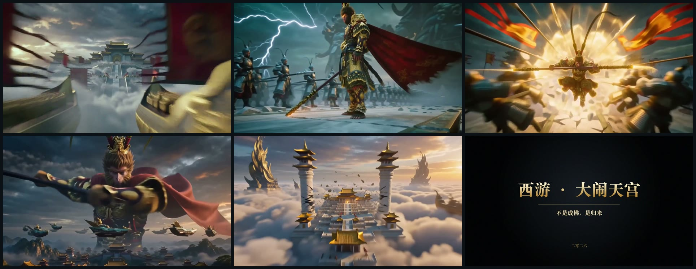
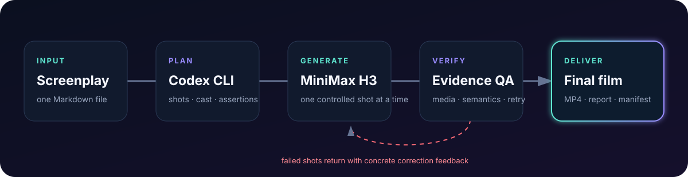
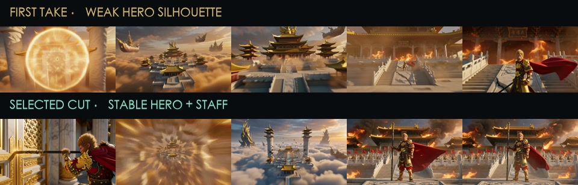
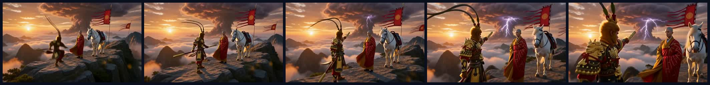
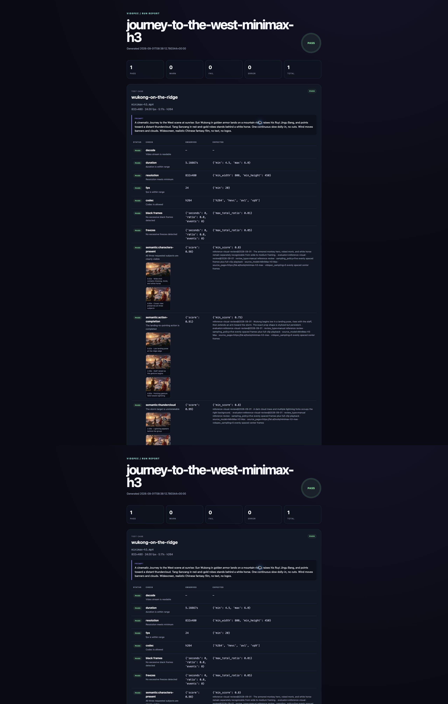

  

<h1 align="center">InkToFilm</h1>

  <strong>One prompt in. A finished film out.</strong> 
  No code. No command line. Just tell Claude Code or Codex what you want to watch.

  
  

  

  <a href="examples/great-havoc-in-heaven/great-havoc-in-heaven-trailer.mp4"><strong>▶ Watch the finished 30-second film</strong></a>

## Say what you want to make

The [InkToFilm skill](skills/inktofilm/SKILL.md) works in both Claude Code and Codex. Claude Code
discovers it automatically through `.claude/skills` when you open this repository; to have it in
every project, link it once with
`ln -s "$PWD/skills/inktofilm" ~/.claude/skills/inktofilm` and invoke it as `/inktofilm`. In Codex,
ask it to install the skill and invoke it as `$inktofilm`. Either way, describe your film in
ordinary language:

> Use the InkToFilm skill to make a 30-second IMAX-style trailer where the Monkey King challenges
> all of Heaven. Live action, monumental scale, no comedy.

Or bring more detail:

> Use the InkToFilm skill to turn my screenplay into a cinematic short. Keep the heroine's face and
> costume consistent, preserve every line of dialogue, and make the ending quiet rather than
> melodramatic.

Or start a series:

> Use the InkToFilm skill to create a three-scene fantasy pilot from this premise. First make a
> 45-second proof of concept, then keep the same cast and world bible for the next scene.

That is the interface. InkToFilm develops the script, plans the shots, generates the footage, checks
whether the story is actually visible, fixes weak takes, edits the selected clips, and returns a
playable film.

When generation is about to begin, the skill asks for a fal API key only if one is not already
available. It keeps the key local and private, shows the spending cap before paid requests, and never
places credentials in the film project or Git history.

## From an idea to a film

  

You give InkToFilm one sentence or a complete screenplay. It handles the rest:

- writes a shootable story and keeps a character and world bible;
- turns the story into cinematic shots with continuity anchors;
- generates every scene with the video model you choose;
- reviews story fidelity, action, composition, anatomy, text, black frames, and freezes;
- retries only the shots that meaningfully failed;
- edits the approved footage, sound, and title cards into one film.

## Demo 1 · *Journey to the West: Great Havoc in Heaven*

The prompt was simple: make a theatrical, live-action *Journey to the West* trailer with blockbuster
scale. InkToFilm wrote a five-shot plan, generated the footage with MiniMax H3 Max, repaired the weak
climax, continued one directly connected action from a selected stable frame, connected the other
shots with lightning and sound bridges, mixed a three-line Mandarin dialogue arc that carries across
two cuts, and typeset the title card locally so the film's only text is exact and reproducible.

  

- Finished film: **30 seconds**, **1344×768**, **24 fps**, stereo audio.
- Quality result: **5 of 5 scenes passed** and **25 of 25 story assertions passed**.
- Generation cost for the selected shots and targeted retries: **$2.00 on fal**; the three spoken
  lines cost less than **$0.10**.
- Public materials: [screenplay](examples/great-havoc-in-heaven/script.md),
  [shot prompts](examples/great-havoc-in-heaven/prompts.md), and
  [evidence-backed review](examples/great-havoc-in-heaven/report/index.html). The edit, the spoken
  lines, and the title card are reproduced by the scripts in
  [`scripts/`](scripts/).

## Demo 2 · It fixes weak takes instead of hiding them

The first climax had a strong explosion but an indistinct hero and unstable weapon. A targeted retry
fixed the character while preserving the best impact beat. InkToFilm selected and edited the useful
moments into the final shot.

  

The final review scored the gate impact **0.91**, layered destruction **0.87**, the full-body Monkey
King **0.96**, character and weapon stability **0.94**, and clean overlays **1.00**.

## Demo 3 · It checks whether the story happened

This separate MiniMax shot asks for Sun Wukong to land beside Tang Sanzang and a white horse, point
toward a thundercloud, and hold all three identities through one camera move.

  

  <a href="examples/journey-to-the-west/minimax-h3.mp4">▶ Watch the generated scene</a>
  ·
  <a href="examples/journey-to-the-west/semantic-results.json">See the reviewed evidence</a>

InkToFilm does not reduce this to one mysterious score. It checks the cast, action order, setting,
identity continuity, camera intent, and unwanted text separately, with visible frame evidence for
each decision.

  

## What you need

- **Claude Code or Codex**, for story development, shot planning, visual review, and the no-code
  conversation.
- **A fal API key**, for MiniMax video generation. InkToFilm can use another video provider when you
  choose one.

The skill handles installation and setup on your behalf. You never need to type a shell command to
make a film.

## What works today

InkToFilm can make complete short films, trailers, and proof-of-concept scenes from one prompt or a
screenplay. Feature films and television episodes are produced scene by scene with a shared cast and
world bible, then assembled from approved scenes.

Video models can still drift in faces, hands, dialogue, or motion. InkToFilm makes those failures
visible and retries them selectively; it does not pretend the underlying models are perfect.

## For builders

The conversational skill is the front door. The engine beneath it remains open and provider-neutral.
See the [technical guide](docs/technical-guide.md), [provider protocols](docs/provider-protocols.md),
[semantic evaluator protocol](docs/semantic-evaluators.md), and
[research design](docs/research-design.md). Contributions are welcome through
[CONTRIBUTING.md](CONTRIBUTING.md).

## License

[MIT](LICENSE)
