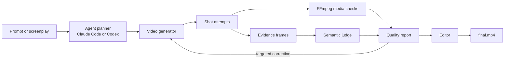

# InkToFilm technical guide

The public README presents the prompt-only agent experience in Claude Code and Codex. This document
covers the engine, command-line interface, and integration points for contributors and automated
workflows.

## Install from source

InkToFilm requires Python 3.9 or newer. FFmpeg and FFprobe provide media inspection and editing.
The `fal` extra installs the default MiniMax provider.

```bash
git clone https://github.com/yingwang/inktofilm.git
cd inktofilm
python3 -m pip install -e '.[fal]'
inktofilm doctor
```

The primary command is `inktofilm`. The legacy `vidspec` command and Python import path remain
available for compatibility.

## Produce a short film

```bash
export FAL_KEY="..."
inktofilm produce screenplay.md --plan-only -o productions/my-film
inktofilm produce screenplay.md -o productions/my-film
```

The production bundle contains the source screenplay, structured plan, character portraits under
`references/`, shot stills under `stills/`, generated attempts, evidence frames, quality report,
manifest, and `final.mp4`. Planning and semantic review default to the locally authenticated Codex
CLI. In Claude Code, the running agent normally plans and judges directly instead: it writes the plan
and suite itself, inspects the sampled evidence frames, and replays its reviewed verdicts through
`--semantic-results`. Video generation defaults to `minimax/h3-max/text-to-video` through the user's
fal account, and to `minimax/h3-max/image-to-video` for any shot that has a still.

`--plan-only` performs no paid video generation. Normal production preserves every attempt and can
retry failed shots. A retry re-shoots the clip and keeps the still, since the still is the settled
composition and only the motion failed. Credentials are read from the environment and are not written
to the bundle.

## Stills, faces, and chained shots

The plan decides these per shot, and the manifest records what each shot actually used.

- `reference_prompt` on a character renders one clean portrait. Every still that includes that
  character is edited from the portrait, which is what holds one face and one costume together across
  the film.
- `still_prompt` on a shot fixes its opening frame as an image before any video credit is spent. The
  shot is then generated from that still.
- `chain_to_next` hands the following shot's still to the video model as this shot's mandated last
  frame, so two clips meet on the same image rather than merely resembling each other. Both shots
  need a still, and the last shot cannot chain.
- `face_reference` names the character whose photographed face should be swapped onto this shot's
  still. Supply the photo at the command line, never in the plan:

```bash
inktofilm produce screenplay.md --face traveler=~/photos/her.jpg -o productions/my-film
```

Use it only where the face is large in frame. On a wide shot the face covers too few pixels for the
swap to survive downscaling, and the result reads as a deformed face rather than a likeness. The
photo goes to the face-swap model and to nothing else: it is never written into a prompt, never sent
to the planner or judge, and never copied into the bundle. `--no-stills` skips stills, swaps, and
chaining entirely and shoots every shot from text alone.

## Bring your own models

An explicitly selected command can replace each provider:

```bash
inktofilm produce screenplay.md \
  --planner-command "my-llm plan --json" \
  --video-command "my-video-model generate --json" \
  --judge-command "my-vlm judge --json" \
  -o productions/custom
```

The adapters exchange documented JSON through standard input and output. See
[provider protocols](provider-protocols.md) and the
[semantic evaluator protocol](semantic-evaluators.md).

## Evaluate existing video

```bash
inktofilm init
inktofilm run inktofilm.json --output reports/latest
inktofilm run inktofilm.json --semantic-codex --output reports/semantic
inktofilm run inktofilm.json --semantic-results reviewed.json --output reports/semantic
```

The runner performs deterministic decode, duration, resolution, frame-rate, codec, black-frame, and
freeze checks. Semantic evaluation is opt-in and attaches sampled frames, scores, rationale, and
provider provenance to each assertion. Suite paths are resolved relative to the suite and may not
escape its directory.

`--semantic-codex` judges the sampled frames with the locally authenticated Codex CLI.
`--semantic-results` replays reviewed verdicts from a JSON file, which is how an agent with vision,
such as Claude Code, acts as the judge itself: it samples the same evenly spaced frames, inspects
them, writes the per-case results with its own model named in the provenance, and runs the suite
against that file. The file format is documented in the
[semantic evaluator protocol](semantic-evaluators.md).

Reviewed results can be replayed without a live model:

```bash
inktofilm run suite.json \
  --semantic-results reviewed-results.json \
  --output reports/replay
```

## Compare runs

```bash
inktofilm compare \
  reports/baseline/report.json \
  reports/candidate/report.json \
  -o reports/comparison
```

`compare` returns exit code `1` when a case regresses or disappears. `run` supports `--fail-on never`,
`warn`, `fail`, or `error` for CI thresholds.

## Architecture



The core keeps provider boundaries narrow: structured planning, shot generation, media probing,
semantic evaluation, reporting, comparison, and editing can evolve independently. Learned judgments
remain auditable and never replace deterministic media checks.

## Development

```bash
python3 -m pip install -e '.[dev,fal]'
ruff check .
pytest -q
```

The real-media test generates healthy and intentionally broken FFmpeg fixtures. Contributions should
add inspectable evidence rather than only another opaque aggregate score. See
[CONTRIBUTING.md](../CONTRIBUTING.md).
