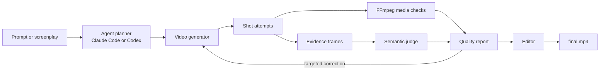

# InkToFilm technical guide

The public README presents the prompt-only agent experience in Claude Code and Codex. This document
covers the engine, command-line interface, and integration points for contributors and automated
workflows.

## Install from source

InkToFilm requires Python 3.9 or newer. FFmpeg and FFprobe provide media inspection and editing.
The `fal` extra installs the default MiniMax provider.

```bash
git clone https://github.com/yingwang/inktofilm.git
cd inktofilm
python3 -m pip install -e '.[fal]'
inktofilm doctor
```

The primary command is `inktofilm`. The legacy `vidspec` command and Python import path remain
available for compatibility.

## Produce a short film

```bash
export FAL_KEY="..."
inktofilm produce screenplay.md --plan-only -o productions/my-film
inktofilm produce screenplay.md -o productions/my-film
```

The production bundle contains the source screenplay, structured plan, character portraits under
`references/`, shot stills under `stills/`, generated attempts, evidence frames, quality report,
manifest, and `final.mp4`. Planning and semantic review default to the locally authenticated Codex
CLI. Video generation defaults to `minimax/h3-max/text-to-video` through the user's fal account, and
to `minimax/h3-max/image-to-video` for any shot that has a still.

`--judge-claude` judges each shot with the locally authenticated Claude Code CLI instead of Codex, so
the whole run needs only Claude Code and a fal key. In Claude Code the running agent can also judge
in the loop rather than as a subprocess: it writes the plan and suite itself, inspects the sampled
evidence frames, and replays its reviewed verdicts through `--semantic-results`. That costs one
model rather than two and lets the agent notice what no assertion happened to ask about, which is
worth keeping in mind, because either judge only scores the assertions the plan actually wrote.

`--plan-only` performs no paid video generation. Normal production preserves every attempt and can
retry failed shots. A take that was judged in an earlier run keeps its verdict
(`assets/attempt-N/<shot>/verdict.json`) and is not sent to the judge again; delete that file to
re-judge it. The plain cut is assembled with every clip scaled and padded to the first clip's frame,
one frame rate, a stereo 48 kHz track (silence where a clip has none) and an x264 encode at CRF 16
with the slow preset, so clips from different providers cut together and the film that leaves
`produce` is not the lossy one. A retry re-shoots the clip and keeps the still, since the still is the settled
composition and only the motion failed. Credentials are read from the environment and are not written
to the bundle.

### Staged and resumable production

The bundle records the parsed plan as `plan.json` and the screenplay as `script.md`, overwriting files of those names in the output directory, so keep an authored plan elsewhere or read the written copy back before editing it. The bundle is resumable: a portrait, still, or shot attempt that already exists in the output
directory is reused, so the same command can be run again after a review and only the missing work
is generated. Four flags turn that into a workflow an agent can drive one stage at a time:

```bash
inktofilm produce screenplay.md --plan plan.json --stills-only -o productions/my-film
inktofilm produce screenplay.md --plan plan.json --no-judge -o productions/my-film
inktofilm frames productions/my-film/shots/shot-02-attempt-1.mp4
inktofilm run productions/my-film/suite.json --semantic-results reviewed.json -o productions/my-film/review
inktofilm produce screenplay.md --plan plan.json --no-judge --reshoot shot-02 -o productions/my-film
```

- `--plan PLAN_JSON` uses a production plan the agent wrote itself instead of running a planner.
- `--stills-only` renders the portraits and stills, then stops before any video credit is spent.
  Delete a still that failed review, sharpen its prompt, and run again; the others are kept.
- `--no-judge` shoots without a semantic evaluator: media checks still run, the newest attempt of
  each shot is selected, `suite.json` is written for the selected clips, and `final.mp4` is a plain
  cut. Judging then happens by replaying reviewed results on that suite.
- `--reshoot SHOT_ID` gives one shot a fresh attempt numbered after the ones on disk, and reuses
  everything else. Repeat the flag for more shots.
- `--select SHOT_ID=ATTEMPT` makes an existing attempt the shot's clip when a reviewer prefers it to
  the newest one. Nothing is generated for a selected shot, and it cannot also be reshot.
- `inktofilm frames VIDEO` samples the evenly spaced frames a semantic judge sees, so a reviewer can
  look at exactly the evidence the verdict will cite. `--count` matches the suite's `sample_frames`.

Each video prompt describes only the characters the shot lists under `characters`, which keeps a
single-character shot from acquiring the rest of the cast in its background.

## Reviewing takes by eye and by curve

`inktofilm frames take.mp4` writes the evenly spaced frames a judge would see. `inktofilm motion
take.mp4` prints a motion-energy curve: the mean absolute luminance change between consecutive
frames, averaged per half second (`--bucket` changes the width), with a bar per bucket. It answers
"does this fight have a rhythm" without playing the clip: bursts separated by a lull read as
tempo, a flat line reads as floating, and values near zero mean nothing moved.

## Stills, faces, and chained shots

The plan decides these per shot, and the manifest records what each shot actually used.

- `reference_prompt` on a character renders one clean portrait. Every still that includes that
  character is edited from the portrait, which is what holds one face and one costume together across
  the film.
- `still_prompt` on a shot fixes its opening frame as an image before any video credit is spent. The
  shot is then generated from that still.
- `chain_to_next` hands the following shot's still to the video model as this shot's mandated last
  frame, so two clips meet on the same image rather than merely resembling each other. Both shots
  need a still, and the last shot cannot chain.
- `continue_from_previous` opens this shot on a frame taken from the previous shot's selected clip
  instead of on a still of its own: `true` takes the frame 0.4 seconds before the clip ends, a number
  takes it that many seconds before the end (a mid-clip frame is a number around half the previous
  duration). The frame is written to `stills/<shot>-from-<previous clip>.jpg` at the clip's own size,
  so selecting or reshooting the previous take produces a fresh frame rather than reusing a stale
  one, and the manifest records `continued_from`. A continued shot cannot also have a `still_prompt`,
  the first shot cannot continue, and a shot that continues cannot be the end frame of a
  `chain_to_next`. Nothing is grabbed or swapped for a shot whose attempts already exist.
- `face_reference` names the character, or a two-item list of characters, whose photographed faces
  are swapped onto this shot's opening frame, whether that frame is a still or a continuation frame.
  Supply the photos at the command line, never in the plan:

```bash
inktofilm produce screenplay.md --face traveler=~/photos/her.jpg -o productions/my-film
inktofilm produce screenplay.md --plan plan.json \
  --face heroine=~/photos/her.jpg --face hero=~/photos/him.jpg \
  --face-gender heroine=female --face-gender hero=male \
  --face-swap-model easel-ai/advanced-face-swap -o productions/my-film
```

Use it only where the face is large in frame. On a wide shot the face covers too few pixels for the
swap to survive downscaling, and the result reads as a deformed face rather than a likeness. When two
people share the frame, list them in `face_reference` in their left-to-right order: with
`easel-ai/advanced-face-swap` both faces go in one request (declare each with `--face-gender`); with
a single-face model the frame is cut into two vertical strips, each strip is swapped for its own
person, and the strips are laid back in place. The photo goes to the face-swap model and
to nothing else: it is never written into a prompt, never sent to the planner or judge, and never
copied into the bundle. `--no-stills` skips stills, swaps, continuation frames, and chaining entirely
and shoots every shot from text alone.

## Bring your own models

An explicitly selected command can replace each provider:

```bash
inktofilm produce screenplay.md \
  --planner-command "my-llm plan --json" \
  --video-command "my-video-model generate --json" \
  --judge-command "my-vlm judge --json" \
  -o productions/custom
```

The adapters exchange documented JSON through standard input and output. See
[provider protocols](provider-protocols.md) and the
[semantic evaluator protocol](semantic-evaluators.md).

## Evaluate existing video

```bash
inktofilm init
inktofilm run inktofilm.json --output reports/latest
inktofilm run inktofilm.json --semantic-codex --output reports/semantic
inktofilm run inktofilm.json --semantic-claude --output reports/semantic
inktofilm run inktofilm.json --semantic-results reviewed.json --output reports/semantic
```

The runner performs deterministic decode, duration, resolution, frame-rate, codec, black-frame, and
freeze checks. Semantic evaluation is opt-in and attaches sampled frames, scores, rationale, and
provider provenance to each assertion. Suite paths are resolved relative to the suite and may not
escape its directory.

`--semantic-codex` and `--semantic-claude` judge the sampled frames with the locally
authenticated Codex CLI or Claude Code CLI respectively.
`--semantic-results` replays reviewed verdicts from a JSON file, which is how an agent with vision,
such as Claude Code, acts as the judge itself: it samples the same evenly spaced frames, inspects
them, writes the per-case results with its own model named in the provenance, and runs the suite
against that file. The file format is documented in the
[semantic evaluator protocol](semantic-evaluators.md).

Reviewed results can be replayed without a live model:

```bash
inktofilm run suite.json \
  --semantic-results reviewed-results.json \
  --output reports/replay
```

## Compare runs

```bash
inktofilm compare \
  reports/baseline/report.json \
  reports/candidate/report.json \
  -o reports/comparison
```

`compare` returns exit code `1` when a case regresses or disappears. `run` supports `--fail-on never`,
`warn`, `fail`, or `error` for CI thresholds.

## Architecture



The core keeps provider boundaries narrow: structured planning, shot generation, media probing,
semantic evaluation, reporting, comparison, and editing can evolve independently. Learned judgments
remain auditable and never replace deterministic media checks.

## Development

```bash
python3 -m pip install -e '.[dev,fal]'
ruff check .
pytest -q
```

The real-media test generates healthy and intentionally broken FFmpeg fixtures. Contributions should
add inspectable evidence rather than only another opaque aggregate score. See
[CONTRIBUTING.md](../CONTRIBUTING.md).
