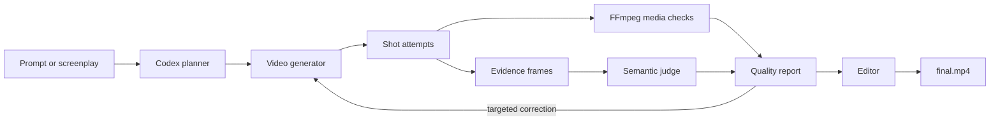

# InkToFilm technical guide

The public README presents the prompt-only Codex experience. This document covers the engine,
command-line interface, and integration points for contributors and automated workflows.

## Install from source

InkToFilm requires Python 3.9 or newer. FFmpeg and FFprobe provide media inspection and editing.
The `fal` extra installs the default MiniMax provider.

```bash
git clone https://github.com/yingwang/inktofilm.git
cd inktofilm
python3 -m pip install -e '.[fal]'
inktofilm doctor
```

The primary command is `inktofilm`. The legacy `vidspec` command and Python import path remain
available for compatibility.

## Produce a short film

```bash
export FAL_KEY="..."
inktofilm produce screenplay.md --plan-only -o productions/my-film
inktofilm produce screenplay.md -o productions/my-film
```

The production bundle contains the source screenplay, structured plan, generated attempts, evidence
frames, quality report, manifest, and `final.mp4`. Planning and semantic review default to the locally
authenticated Codex CLI. Video generation defaults to `minimax/h3-max/text-to-video` through the
user's fal account.

`--plan-only` performs no paid video generation. Normal production preserves every attempt and can
retry failed shots. Credentials are read from the environment and are not written to the bundle.

## Bring your own models

An explicitly selected command can replace each provider:

```bash
inktofilm produce screenplay.md \
  --planner-command "my-llm plan --json" \
  --video-command "my-video-model generate --json" \
  --judge-command "my-vlm judge --json" \
  -o productions/custom
```

The adapters exchange documented JSON through standard input and output. See
[provider protocols](provider-protocols.md) and the
[semantic evaluator protocol](semantic-evaluators.md).

## Evaluate existing video

```bash
inktofilm init
inktofilm run inktofilm.json --output reports/latest
inktofilm run inktofilm.json --semantic-codex --output reports/semantic
```

The runner performs deterministic decode, duration, resolution, frame-rate, codec, black-frame, and
freeze checks. Semantic evaluation is opt-in and attaches sampled frames, scores, rationale, and
provider provenance to each assertion. Suite paths are resolved relative to the suite and may not
escape its directory.

Reviewed results can be replayed without a live model:

```bash
inktofilm run suite.json \
  --semantic-results reviewed-results.json \
  --output reports/replay
```

## Compare runs

```bash
inktofilm compare \
  reports/baseline/report.json \
  reports/candidate/report.json \
  -o reports/comparison
```

`compare` returns exit code `1` when a case regresses or disappears. `run` supports `--fail-on never`,
`warn`, `fail`, or `error` for CI thresholds.

## Architecture



The core keeps provider boundaries narrow: structured planning, shot generation, media probing,
semantic evaluation, reporting, comparison, and editing can evolve independently. Learned judgments
remain auditable and never replace deterministic media checks.

## Development

```bash
python3 -m pip install -e '.[dev,fal]'
ruff check .
pytest -q
```

The real-media test generates healthy and intentionally broken FFmpeg fixtures. Contributions should
add inspectable evidence rather than only another opaque aggregate score. See
[CONTRIBUTING.md](../CONTRIBUTING.md).
